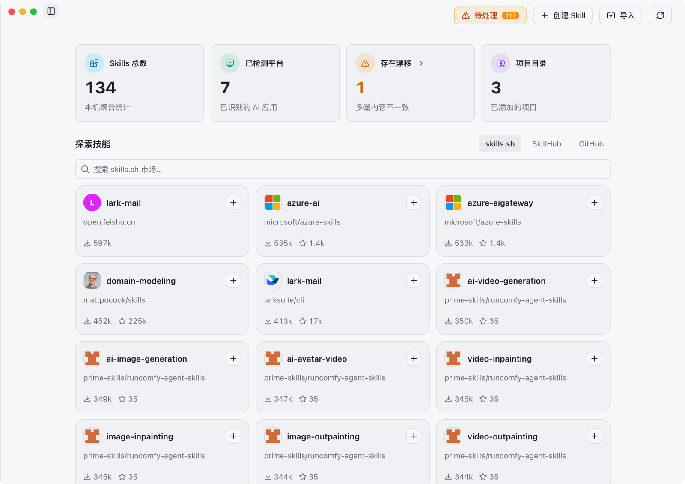
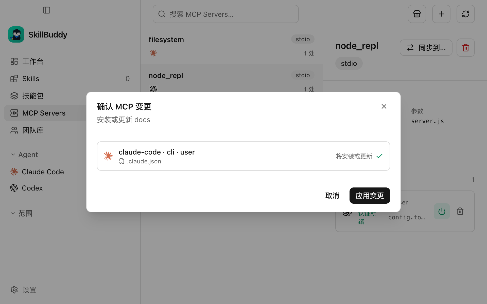
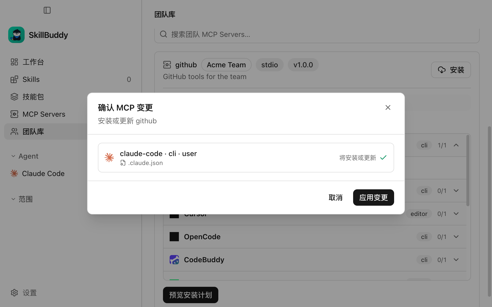

<p align="center">
  
</p>

<h1 align="center">SkillBuddy</h1>

<p align="center">
  跨 AI Agent 管理、安装、同步 Skills 与 MCP Servers 的桌面工作台。
</p>

<p align="center">
  <a href="README_EN.md">English</a> · 简体中文
</p>

<p align="center">
  
  
  
</p>

SkillBuddy 将不同 AI 编程工具分散在各自目录中的 Skills 和 MCP 配置聚合到一个界面中。你可以查看本机安装状态、跨平台分发内容、处理多端漂移、从市场发现资源，并通过 Git 团队库管理经过审核的团队资产。

> `v0.1.0` 是首个公开预览版本。功能和本地数据格式仍可能在后续 `0.x` 版本中调整。

## 界面预览



<table>
  <tr>
    <td width="50%">
      
      <p align="center">MCP Servers 管理</p>
    </td>
    <td width="50%">
      
      <p align="center">变更前预览配置写入</p>
    </td>
  </tr>
  <tr>
    <td colspan="2">
      
      <p align="center">从 Git 团队库安装经过审核的 MCP Server</p>
    </td>
  </tr>
</table>

## 核心能力

- **统一资产视图**：自动发现并聚合不同 Agent 中的 Skills 和 MCP Servers。
- **跨平台安装**：将同一个 Skill 安装到多个用户级或项目级目标。
- **漂移检测与同步**：发现同名 Skill 在不同平台上的内容差异，选择基准版本后同步。
- **启用、禁用和卸载**：在可管理目录中调整 Skill 状态，删除操作支持移入废纸篓和撤销。
- **Skills 市场**：搜索 skills.sh、SkillHub 和 GitHub，查看内容与资源后安装。
- **MCP 市场与配置计划**：发现 MCP Server，检查目标平台能力，在写入前预览具体变更。
- **Preset 与技能包**：保存常用 Skill 组合，批量安装、启停或导入导出。
- **Git 多设备备份**：将用户级 Skills 和 Preset 保存到私有 Git 仓库，并在其他设备预览恢复。
- **Git 团队库**：通过受保护分支和 PR/MR 管理团队 Skills、MCP、岗位包和策略。
- **项目合规**：使用 `.skillbuddy/team.yaml` 声明项目依赖，检查缺失、过期、禁用和无效引用。
- **自定义平台**：配置额外 Agent 的检测路径、用户目录和项目目录。
- **中英文界面**：内置简体中文和英文。

## 支持平台

SkillBuddy 内置以下 Skills 目录约定：

| Agent | 用户级 | 项目级 |
| --- | :---: | :---: |
| Claude Code | ✓ | ✓ |
| Codex | ✓ | ✓ |
| Cursor | ✓ | ✓ |
| OpenCode | ✓ | ✓ |
| GitHub Copilot | ✓ | ✓ |
| Gemini CLI | ✓ | ✓ |
| CodeBuddy | ✓ | ✓ |
| Trae / Trae CN | ✓ | ✓ |
| WorkBuddy | ✓ | - |
| 豆包 | ✓ | - |
| Kimi Code | ✓ | ✓ |
| Z Code | ✓ | ✓ |

不同平台的 MCP 配置格式、作用域和能力并不完全一致。SkillBuddy 会在界面中展示实际检测到的入口和能力，并在应用变更前进行校验。部分平台约定仍需要更多真机反馈，详见 [平台约定说明](docs/platform-conventions.md)。

## 下载与运行

首个预览版计划提供 **macOS 11 及以上、Apple Silicon** 安装包：

- [前往 GitHub Releases](https://github.com/konnga/skill-buddy/releases)
- Windows 和 Linux 已包含基础构建配置，但首版尚未作为正式发行目标验证。

SkillBuddy 会读取各 Agent 已有的本地目录。安装、同步、启停或删除等写操作只会作用于界面中明确选择的目标。

## 团队使用

团队可以使用 Git 仓库作为内容、版本、权限和审计的事实来源：

- 维护者在隔离的 `skillbuddy/<标识>` 分支中编辑 Skills、MCP、岗位包和策略。
- 发布前可以审阅文件列表、校验结果和 Git diff。
- GitHub 使用 `gh` 创建 Pull Request，GitLab 使用 `glab` 创建 Merge Request。
- 普通成员只能浏览和安装团队库中已经合并的内容。
- 私有仓库认证交给系统 Git、SSH Agent 或凭据管理器，SkillBuddy 不保存仓库密码。

完整格式与工作流见 [Git 团队库文档](docs/team-library.md)。

## 安全与隐私

- SkillBuddy 默认在本地扫描和管理文件，不要求登录 SkillBuddy 账号。
- GitHub Token 仅用于提升市场 API 限额，并存储在系统安全存储中。
- MCP 定义不允许包含明文 Token、密码或 API Key，敏感值应使用环境变量或密钥引用。
- Git 备份不包含 MCP 配置、Token、本机绝对路径、项目级 Skill 或启停状态。
- 系统、管理员和插件拥有的只读 Skill 不会被编辑或删除。
- 主进程会校验可访问路径，拒绝越过受管目录的写入和符号链接逃逸。

## 项目结构

```text
skill-buddy/
├── apps/
│   ├── desktop/       # Electron + Vue 3 桌面应用
│   └── registry/      # 可选的 Fastify + SQLite 自托管 Registry
├── packages/
│   ├── core/          # 统一数据模型、扫描、聚合、适配器与安全校验
│   └── cli/           # skm 命令行工具
└── docs/              # 设计、平台约定、Registry 与团队库文档
```

桌面端团队协作默认使用 Git 团队库，不依赖 Registry。Registry 和 CLI 作为可选的自托管、自动化能力保留，详见 [Registry 文档](docs/registry.md)。

## 本地开发

要求：

- Node.js 22 或更高版本
- pnpm 10 或更高版本
- Git

```bash
pnpm install
pnpm dev
```

常用命令：

```bash
pnpm build       # 构建所有 workspace 包
pnpm test        # 运行单元测试
pnpm test:e2e    # 构建并运行 Electron 端到端测试
pnpm typecheck   # 执行全仓库类型检查
```

## 贡献

Issue 和 Pull Request 都欢迎。提交前请尽量：

1. 说明受影响的平台、作用域和复现步骤。
2. 对共享逻辑补充相应测试。
3. 运行与修改范围相关的类型检查或测试。
4. 避免提交真实 Token、本机路径或团队私有内容。

## 开源协议

开源协议将在 `v0.1.0` 发布前确定。当前建议在 MIT 与 Apache License 2.0 之间选择；确定后会在仓库根目录加入 `LICENSE`，并同步更新所有 workspace 的包元数据。
