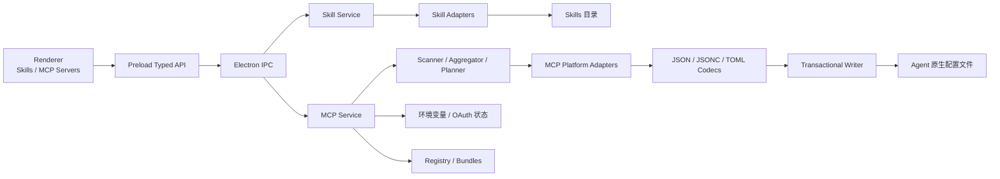

# MCP 管理技术设计

> 版本：v0.3 ｜ 日期：2026-08-10 ｜ 状态：阶段 0-5 已实现，平台真机验收持续进行

## 1. 背景与决策

SkillBuddy 当前以跨 Agent 的 Skills 管理为核心。MCP 同样具有明显的跨平台
管理需求，但它与 Skills 的存储和生命周期不同：

- Skills 是独立目录资源，主要操作是扫描、复制、删除和目录内容 Hash。
- MCP 是各 Agent 配置文件中的结构化配置，主要操作是解析、局部合并、保留
  未知字段、处理作用域、密钥和并发修改。

因此采用以下架构决策：

1. **Skills 与 MCP 是并列资源域**，共享平台标识、项目目录和产品外壳，
   不共享 Adapter、扫描器和写入逻辑。
2. **Agent 原生配置仍是唯一事实来源**，MCP 不引入本地数据库作为隐藏状态。
3. **平台差异终结在 MCP Adapter 层**，Core 和 UI 只使用平台中立模型。
4. **所有写入必须经过预览、权限校验和事务写入**，不得向 Renderer 暴露
   任意文件写接口。
5. **真实密钥和 OAuth Token 不参与跨平台同步**，只同步引用和缺失状态。

豆包继续保留 Skills 支持，但不注册 MCP Adapter，也不出现在 MCP 安装目标中。

## 2. 目标与边界

### 2.1 第一版目标

- 自动发现各 Agent 的 MCP 配置来源。
- 聚合同名 MCP Server，展示平台、入口、作用域和启停状态。
- 安装、更新、卸载和平台原生启停。
- 从一个安装实例同步到多个 Agent，并在执行前展示转换结果。
- 基于稳定 Hash 检测定义漂移、状态差异和同名冲突。
- 检测所需环境变量是否缺失，提示用户在目标平台完成 OAuth。
- 保留配置文件中的注释、格式、未知字段和非 MCP 配置。
- 并发修改时拒绝覆盖，并允许从短期备份撤销最近操作。

### 2.2 第一版非目标

- 不作为 MCP Server 的进程管理器，不负责常驻、重启和日志采集。
- 不探测 Server 的工具调用质量，不做代理或协议网关。
- 不跨平台复制 OAuth Token、明文环境变量或 Authorization Header。
- 不把平台不支持的“禁用”模拟成删除配置。
- 不实现面向公众的完整 MCP Marketplace。
- 不在 Registry、Bundle 或 IPC 中保存和分发真实密钥。

## 3. 总体架构



依赖方向固定为：

```text
Renderer
  -> Preload API
  -> Main Process MCP IPC
  -> packages/core/mcp
  -> Platform Adapter
  -> Codec + Transaction
  -> Agent 原生配置
```

`packages/core` 不依赖 Electron；主进程负责权限、进程边界、文件监听和
备份目录；Renderer 只接收脱敏后的领域对象。

## 4. 目录与模块边界

当前实现模块：

```text
packages/core/src/mcp/
├── types.ts                 # 平台中立领域模型
├── capabilities.ts          # 平台能力与校验
├── catalog.ts               # 内置平台 MCP 描述
├── scanner.ts               # 配置来源发现与扫描
├── normalize.ts             # 平台配置归一化和脱敏
├── aggregate.ts             # 聚合、Hash、漂移与冲突
├── operations.ts            # Projection、计划类型与配置变更
├── transaction.ts           # 乐观锁和原子写入
├── codecs/
│   ├── types.ts
│   ├── shared.ts
│   ├── json.ts              # JSON / JSONC 局部编辑
│   └── toml.ts
└── adapters/
    ├── types.ts
    ├── platform-adapter.ts   # 由 Catalog Profile 驱动的通用 Adapter
    └── index.ts

apps/desktop/src/main/mcp/
├── service.ts               # 扫描快照、计划和执行编排
├── path-policy.ts           # MCP 专用路径权限
├── backups.ts               # 短期备份和撤销
└── watcher.ts               # 配置文件监听

apps/desktop/src/main/ipc/mcp.ts
apps/desktop/src/renderer/src/composables/useMcpServers.ts
apps/desktop/src/renderer/src/views/McpServersView.vue
apps/desktop/src/renderer/src/components/mcp/
apps/desktop/src/renderer/src/components/team/TeamMcpCatalog.vue
apps/desktop/src/renderer/src/components/bundles/BundleMcpSection.vue

apps/registry/src/mcp.ts       # Registry MCP 入站白名单与脱敏
apps/registry/src/server.ts    # MCP、策略和混合 Bundle API
packages/core/src/registry-client.ts
packages/cli/src/index.ts      # mcp / bundle 命令
```

现有 `AgentAdapter`、`scanInstalledSkills()`、`aggregateSkills()` 和
`useSkills.ts` 不承担 MCP 职责。

## 5. 领域模型

### 5.1 基础类型

```ts
export type McpScope = 'user' | 'project' | 'local'

export type McpSourceOrigin =
  | 'user'
  | 'project'
  | 'local'
  | 'plugin'
  | 'connector'
  | 'marketplace'
  | 'admin'
  | 'system'

export type McpTransport =
  | 'stdio'
  | 'streamable-http'
  | 'sse'
  | 'websocket'

export type McpValueRef =
  | { kind: 'literal'; value: string }
  | { kind: 'env'; name: string }
  | { kind: 'secret'; key: string; state: 'configured' | 'missing' | 'unknown' }
```

`McpValueRef.secret` 不包含真实值。扫描到原生配置中的敏感字面量时，主进程
只向 Renderer 返回 `configured`；该值不能成为跨平台同步的数据源。

### 5.2 Server 定义

```ts
export interface McpStdioTransport {
  kind: 'stdio'
  command: string
  args: string[]
  cwd?: string
  env: Record<string, McpValueRef>
}

export interface McpRemoteTransport {
  kind: 'streamable-http' | 'sse' | 'websocket'
  url: string
  headers: Record<string, McpValueRef>
}

export interface McpServerDefinition {
  name: string
  description?: string
  transport: McpStdioTransport | McpRemoteTransport
  requiredSecrets: string[]
  metadata?: Record<string, unknown>
}
```

Definition 只表达跨平台可移植内容。平台专属权限规则、工具白名单、延迟加载
等字段保存在安装实例的 `platformMetadata` 中；同步时默认不迁移，除非目标
Adapter 显式声明可转换。

### 5.3 配置来源与安装实例

```ts
export interface McpConfigSource {
  id: string
  agent: AgentId
  surface: string
  scope: McpScope
  projectRoot?: string
  configPath: string
  format: 'json' | 'jsonc' | 'toml'
  origin: McpSourceOrigin
  readOnly: boolean
}

export interface McpInstallation {
  id: string
  definition: McpServerDefinition
  source: McpConfigSource
  enabled: boolean | null
  authState: 'ready' | 'missing-secrets' | 'requires-oauth' | 'unknown'
  definitionHash: string
  sourceHash: string
  modifiedAt?: number
  platformMetadata?: Record<string, unknown>
}
```

这里必须区分三个概念：

- `agent`：产品，例如 GitHub Copilot。
- `surface`：同一产品的本地接入面，例如 CLI、VS Code。
- `source`：某个具体作用域中的配置来源，例如项目 `.vscode/mcp.json`。

这样 Copilot 等多入口平台不会被压缩成一个错误的布尔状态。

### 5.4 聚合结果

```ts
export interface AggregatedMcpServer {
  name: string
  installations: McpInstallation[]
  hasDefinitionDrift: boolean
  hasStateDrift: boolean
  conflictKind?: 'transport' | 'endpoint' | 'command' | 'credentials' | 'unknown'
}
```

- `hasDefinitionDrift`：可移植定义的 Hash 不一致。
- `hasStateDrift`：启停或认证就绪状态不一致，不等于定义漂移。
- `conflictKind`：同名但关键身份字段明显不同，必须由用户选择基准，不能
  自动覆盖。

## 6. 平台能力模型

MCP 支持不能只用 `supported: boolean` 表示。每个 `agent + surface` 都要声明：

```ts
export interface McpPlatformCapabilities {
  management: 'read-write' | 'read-only'
  scopes: McpScope[]
  transports: McpTransport[]
  configFormats: Array<'json' | 'jsonc' | 'toml'>
  supportsOAuth: boolean
  supportsEnvReferences: boolean
  supportsHeaderReferences: boolean
  toggle: 'native' | 'unsupported'
  protocolFeatures: {
    tools: boolean
    prompts: boolean
    resources: boolean
    roots: boolean
    elicitation: boolean
    apps: boolean
  }
}
```

能力声明有三个用途：

1. 扫描时正确解释原生配置。
2. 计划同步时提前识别不兼容和信息损失。
3. UI 只展示平台真实支持的操作，不制造“看似成功”的功能。

首轮适配范围如下，具体路径和字段映射由 Adapter fixture 固化：

| 平台 | Surface | 格式 / 作用域 | 当前管理模式 | 验收说明 |
|---|---|---|---|---|
| Claude Code | CLI | JSON；user / project / local | 读写 | Fixture 与事务测试已覆盖 |
| Codex | CLI | TOML；user / project | 读写 | Fixture 与事务测试已覆盖 |
| Cursor | editor | JSON；user / project | 读写 | Fixture 已覆盖 |
| OpenCode | CLI | JSONC；user / project | 读写 | Fixture 已覆盖 |
| CodeBuddy | CLI | JSON / JSONC；user / project / local | 读写 | 已实现官方 fallback 优先级 |
| Trae / Trae CN | editor | JSON；user / project | 读写 | Trae CN 全局路径待真机复核 |
| Kimi Code | CLI | JSON；user | 读写 | 路径与加载结果待真机复核 |
| Z Code | native / `.agents` | JSON；user / project | 只读 | 原生入口待稳定官方写入契约 |
| WorkBuddy | desktop / connector | JSON / 托管来源 | 本地读写，Connector 只读 | 来源优先级待真机复核 |
| Gemini CLI | CLI | JSON；user / project | 读写 | Fixture 已覆盖 |
| GitHub Copilot | CLI / VS Code / Cloud | JSON；user / project / cloud | CLI、VS Code 读写；Cloud 只读 | 三个 surface 独立；VS Code 不宣称原生启停 |
| 豆包 | 无 | 无 | 不注册 Adapter | 明确排除 |

Copilot Cloud、WorkBuddy Connector、插件和管理员配置如果没有稳定的本地写入
协议，第一版只读展示；不得把 Marketplace 中“可安装”条目误认为“已安装”。

## 7. Adapter 与 Codec

### 7.1 Adapter 合约

```ts
export interface McpAdapter {
  readonly agent: AgentId
  readonly surface: string
  readonly displayName: string
  readonly capabilities: McpPlatformCapabilities

  detect(): Promise<boolean>
  configSources(projectRoots: string[]): Promise<McpConfigSource[]>
  read(source: McpConfigSource): Promise<McpInstallation[]>
  project(definition: McpServerDefinition, target: McpTarget): McpProjection
  upsert(definition: McpServerDefinition, target: McpTarget): Promise<McpWriteResult>
  remove(name: string, target: McpTarget): Promise<McpWriteResult>
  setEnabled(name: string, enabled: boolean, target: McpTarget): Promise<McpWriteResult>
}
```

`project()` 是纯函数：把 Canonical Definition 转换为目标平台可以表达的配置，
同时返回阻断项、警告和丢失字段。真正写文件之前，UI 必须能看到这个结果。

### 7.2 Codec 合约

```ts
export interface McpConfigCodec {
  parse(text: string): McpConfigDocument
  list(document: McpConfigDocument, nodePath: string[]): unknown[]
  upsert(document: McpConfigDocument, nodePath: string[], name: string, value: unknown): TextEdit[]
  remove(document: McpConfigDocument, nodePath: string[], name: string): TextEdit[]
  validate(text: string): void
}
```

Codec 只处理格式和目标节点，不知道 Agent 路径、作用域与能力。Adapter 负责：

- 配置文件位置和发现优先级。
- MCP 节点名称，例如 `mcpServers`、`mcp_servers`、`mcp`、`mcp.servers`。
- 原生字段与 Canonical Definition 的双向映射。
- 平台专属字段和只读来源。

实现要求：

- JSON 使用结构化解析和局部文本编辑。
- JSONC 必须保留注释、尾逗号和用户格式。
- TOML 必须基于语法树定位表和键，禁止使用正则替换。
- 不允许通过 `JSON.stringify` 或完整重新序列化覆盖用户配置。
- TOML 格式保真能力需要先做技术验证；未达到验收条件前，Codex 写入功能
  不得标记为完成。

## 8. 扫描、归一化与漂移

扫描链路如下：

```text
McpAdapter.detect
  -> configSources(projectRoots)
  -> read(source)
  -> normalize + redact
  -> stable definition hash
  -> aggregate by name
  -> classify drift / conflict / auth state
```

### 8.1 Hash 规则

`definitionHash` 包含：

- transport 类型。
- stdio 的 command、args、cwd 和环境变量键名。
- remote 的 URL、Header 键名和引用类型。
- Adapter 明确声明为可移植的 metadata。

Hash 不包含：

- 真实环境变量值、Token 和 Authorization Header。
- OAuth 登录状态。
- agent、surface、scope、configPath。
- enabled、modifiedAt、注释和格式。

字段递归按键排序后再计算 SHA-256。除协议明确等价的形式外，不擅自规范化
命令、参数和 URL，避免把实际不同的配置误判为一致。

### 8.2 聚合身份

第一版按 `name` 聚合，符合现有 Skills 的产品心智。但出现以下情况时必须标记
冲突，而不是直接视为普通漂移：

- 同名但 transport 不同。
- 同名 remote URL 不同。
- 同名 stdio command 不同。

用户选择某个安装实例作为基准后，Planner 才能生成覆盖计划。

## 9. 计划、同步与执行

Renderer 不直接发送完整配置或目标路径，而是发起语义请求：

```text
选择源安装实例和目标
  -> Main Process 重新读取源配置
  -> Planner 生成每个目标的 Projection
  -> 返回预览、警告、缺失密钥和预计修改节点
  -> 用户确认
  -> Main Process 校验 Plan 未过期且源文件 Hash 未变化
  -> 执行事务写入
  -> 重新扫描并返回结果
```

计划对象建议为：

```ts
export interface McpOperationPlan {
  id: string
  createdAt: number
  expiresAt: number
  sourceInstallationId?: string
  actions: McpPlanAction[]
  blockers: McpPlanIssue[]
  warnings: McpPlanIssue[]
}
```

Plan 保存在主进程短期内存中。Renderer 只能提交 `planId`；执行时再次验证
来源和目标 Hash，防止使用旧预览覆盖用户刚刚在 Agent 中做的修改。

同步规则：

- 不支持目标 transport：阻断。
- 不支持目标 scope：阻断，并提示可用 scope。
- 平台扩展字段无法转换：警告，默认不复制。
- 缺少环境变量：允许写入引用，但结果标记为不可用。
- 源配置含不可导出的本地秘密：不复制真实值，目标标记为缺少密钥。
- 目标已经存在且定义不同：必须展示覆盖预览。

## 10. 事务写入与撤销

每个配置文件的写入过程固定为：

1. 读取原始字节、权限、mtime 和 SHA-256。
2. 解析原文，确认目标节点存在或可安全创建。
3. 生成最小文本编辑，只修改目标 MCP Server。
4. 对编辑结果重新解析和结构校验。
5. 写入同目录临时文件并继承原文件权限；新建敏感配置默认 `0600`。
6. 写入前重新计算原文件 Hash，发现变化立即返回并发冲突。
7. `fsync` 临时文件后原子替换；支持的平台继续同步目录项。
8. 将原始内容写入应用数据目录中的短期备份并记录操作摘要。
9. 重新读取目标 Agent 配置，确认写入结果可以被 Adapter 解析。

禁止行为：

- 先截断原文件再写入。
- 解析失败后“修复”为一个空配置。
- 覆盖未知顶层字段。
- 修改只读来源。
- 用删除配置模拟平台没有提供的禁用能力。

多目标同步不是跨文件系统的真正原子事务。执行策略是逐目标独立事务，并返回
每个目标的成功或失败；已成功目标可以通过对应备份撤销，不自动回滚用户随后
可能已经修改的文件。

## 11. 密钥与 OAuth

安全边界如下：

- 配置文件解析只发生在主进程/Core，不在 Renderer。
- 真实 env、Header 和 Token 永远不通过 IPC 返回。
- Canonical Definition 只保留变量名、引用种类和配置状态。
- `process.env` 检测只返回 `configured/missing`，不返回值。
- OAuth Token 保留在各平台原生存储，由各平台负责登录、刷新和吊销。
- SkillBuddy 第一版只展示 `requires-oauth`，并调用平台提供的登录入口或给出
  操作指引，不读取 Token。
- Electron `safeStorage` 仅用于用户未来明确交给 SkillBuddy 托管的本地秘密，
  不作为第一版默认方案。
- 团队 Registry 未来只保存 `requiredSecrets: string[]`，不保存真实秘密。

远程 MCP URL 也需要脱敏：发现 URL Query 中疑似 Token 时，Renderer 只能看到
脱敏 URL，且该字面量不可跨平台复制。

## 12. Electron IPC 与路径权限

MCP 使用独立的 `McpPathAccessPolicy`，不把配置文件伪装成 Skills 根目录。

权限规则：

- 只允许访问已注册 Adapter 解析出的官方配置路径。
- 项目级路径必须位于设置中已登记的 `projectRoots`。
- Adapter 标记为 `readOnly` 的 plugin、connector、admin、system、cloud 来源
  禁止写入。
- 已存在的配置文件本身若为符号链接则拒绝写入；项目来源仍必须匹配已登记
  `projectRoots`。不对父目录做 `realpath` 等值判断，避免误伤 macOS
  `/var -> /private/var` 等系统路径映射。
- Renderer 不得通过 IPC 提交任意 `configPath` 或任意 JSON 节点路径。
- 自定义 MCP 平台后续单独设计权限，不复用当前“自定义 Skills 目录”设置。

建议 IPC：

```ts
interface McpApi {
  scan(projectRoots: string[]): Promise<AggregatedMcpServer[]>
  listPlatforms(): Promise<McpPlatformStatus[]>
  createUpsertPlan(input: McpUpsertRequest): Promise<McpOperationPlan>
  createRemovePlan(input: McpRemoveRequest): Promise<McpOperationPlan>
  createTogglePlan(input: McpToggleRequest): Promise<McpOperationPlan>
  applyPlan(planId: string): Promise<McpOperationResult>
  restoreBackup(operationId: string): Promise<McpOperationResult>
  watchStart(projectRoots: string[]): Promise<void>
  onChanged(callback: () => void): () => void
}
```

所有错误通过稳定错误码表达，例如：

- `MCP_CONFIG_PARSE_FAILED`
- `MCP_CONFIG_CHANGED`
- `MCP_TARGET_READ_ONLY`
- `MCP_TRANSPORT_UNSUPPORTED`
- `MCP_SCOPE_UNSUPPORTED`
- `MCP_SECRET_NOT_EXPORTABLE`
- `MCP_WRITE_VALIDATION_FAILED`

UI 根据错误码生成可行动提示，不直接依赖底层异常文本。

## 13. 前端信息架构

前端将资源分为并列入口：

```text
资源
├── Skills
└── MCP Servers

Bundles
└── 同时引用 SkillRef 和 McpRef
```

新增 `useMcpServers.ts`，独立维护：

- 扫描结果和加载错误。
- 平台、surface、scope 和状态筛选。
- 漂移、冲突、密钥缺失筛选。
- 计划预览和执行结果。
- 配置文件变化后的静默刷新。

MCP Server 详情至少展示：

- transport、command 或 endpoint。
- 各平台安装矩阵和作用域。
- 平台原生启停状态。
- 定义漂移与同名冲突。
- 缺失环境变量和 OAuth 状态。
- 来源类型与是否只读。
- 同步后可能丢失的平台专属字段。

“启停”按钮只在 Adapter 声明 `toggle: native` 时出现。其余平台展示“该平台
不支持直接停用”，卸载保持为独立操作。

## 14. Registry 与 Bundle

Registry 已保持 Skills 与 MCP 独立建模：

```text
mcp_servers
mcp_server_versions
required_mcp_servers
bundles
```

MCP 版本只包含脱敏后的 Canonical Definition 和 `requiredSecrets`。团队策略可
表达“要求安装哪些 MCP Server”。允许的 transport、endpoint、Agent 和 scope
白名单仍属于后续策略扩展，不在当前数据模型中伪装支持。

当前实现包括：

- MCP 搜索、详情、不可变版本、语义化 latest 和发布 API。
- `required_mcp_servers` 团队必装策略。
- 同时引用 Skills 与 MCP Servers 的版本化 Bundle；发布时校验引用存在。
- Team 页面中的 MCP 搜索、密钥要求展示、目标选择、计划确认和撤销。
- 本地 Bundle Manifest 支持 Skills、MCP 或混合内容；MCP 必须逐项经过计划预览。
- CLI 的 `mcp search/publish/install/sync` 与 `bundle install`。

策略不得包含 Token、OAuth 状态、本机审批状态和平台原生凭据。

## 15. 实施阶段

### 阶段 0：格式验证与 Fixture

- 收集 Claude Code、Codex、Cursor、OpenCode 的最小和复杂真实配置样本。
- 验证 JSONC/TOML 局部编辑和格式保真。
- 固化未知字段、注释、空文件、损坏文件和并发修改测试样本。

退出条件：四类配置可以读取并完成最小编辑，未触碰节点逐字节保持不变。

状态：**已完成（2026-08-10）**。

- JSON / JSONC 使用 `jsonc-parser` 的局部文本编辑。
- TOML 使用固定版本 `@decimalturn/toml-patch@3.0.2` 的 CST 补丁。
- 已加入 Claude Code、Codex、Cursor、OpenCode 四类脱敏 Fixture。
- 已覆盖新增、更新、删除、空文件、损坏文件、注释和未知字段保留。
- TOML 验证发现隐式父表新增兄弟项和父表删除遗留后代的问题，Codec 已分别
  通过显式父表补全和分层删除规避。
- TOML 依赖升级前必须重新运行格式保真 Fixture；当前兼容处理读取该版本的
  CST 结构，不允许无验证升级。

### 阶段 1：Core 只读链路

- 完成领域模型、能力目录和前四个平台 Adapter。
- 完成扫描、脱敏、聚合、Hash、漂移和冲突分类。
- 先接入 MCP 列表与详情，不开放写操作。

状态：**已完成（2026-08-10）**。领域模型、能力目录、Scanner、Normalize、
Aggregate、Definition Hash、漂移与冲突检测已落地；Renderer 的状态独立保存在
`useMcpServers.ts`，未混入 Skills 状态。

### 阶段 2：本地写操作

- 完成 Planner、Projection、MCP 路径策略和事务写入。
- 接入安装、更新、卸载、原生启停、预览和撤销。
- 接入配置文件监听和并发冲突提示。

状态：**已完成（2026-08-10）**。计划只向 Renderer 暴露 `planId` 和摘要；
主进程持有原文与变更，执行时使用 Hash 乐观锁、同目录原子替换、权限继承和
60 秒备份撤销。IPC 入站会拒绝明文字面量、敏感命令参数、脱敏占位符以及带
凭据、查询参数或片段的远程 URL。

### 阶段 3：其余本地平台

- CodeBuddy、Trae / Trae CN、Kimi Code、ZCode、WorkBuddy。
- 托管 Connector、插件和 Marketplace 来源优先只读展示。

状态：**已完成代码适配（2026-08-10）**。CodeBuddy、Trae / Trae CN、Kimi
Code、Z Code、WorkBuddy 均有独立 Profile 和 Fixture；Z Code 不稳定入口与
WorkBuddy Connector 保持只读。表 6 中标记的路径仍需对应产品真机复核。

### 阶段 4：复杂入口

- Gemini CLI。
- GitHub Copilot CLI、VS Code 和 Cloud 分 surface 适配。
- Cloud 来源仅在存在稳定官方接口和认证方案时开放写入。

状态：**已完成代码适配（2026-08-10）**。Gemini CLI、Copilot CLI、Copilot
VS Code 和 Copilot Cloud 分 surface 建模；Cloud 只读。VS Code 暂不支持原生
启停，避免写入未经证实的 `enabled` 字段。

### 阶段 5：团队分发

- Registry MCP 定义、版本和团队策略。
- Bundle 同时引用 Skills 和 MCP Servers。
- 团队端只分发密钥要求，不分发真实密钥。

状态：**已完成（2026-08-10）**。Registry 使用独立表保存 MCP、不可变版本、
必装策略和混合 Bundle；入站定义采用字段白名单并统一把密钥状态保存为
`unknown`。Desktop Team 页面和本地 Bundle 共用 MCP 计划确认与撤销链路；
CLI 支持 MCP 与混合 Bundle 的团队安装。

## 16. 测试与完成标准

每个 Adapter 必须有真实脱敏 Fixture，覆盖：

- detect 和配置来源发现。
- 原生配置到 Canonical Definition 的转换。
- Canonical Definition 到目标原生配置的 Projection。
- 新增、更新、删除和平台原生启停。
- 注释、格式、未知字段和非 MCP 节点保留。
- 空文件、损坏文件、只读文件和符号链接。
- 原文件被并发修改时拒绝写入。
- 明文密钥、Header 和 OAuth 信息不经过 IPC。
- 不支持的 transport、scope 和字段产生正确阻断或警告。

单个平台达到以下条件才可以在 UI 标记“支持 MCP 管理”：

1. 官方路径和作用域有来源或真机验证。
2. 扫描不会把 Marketplace、插件缓存误判为已安装。
3. Round-trip 后未修改区域保持不变。
4. 写入失败不会损坏原配置，并能从备份恢复。
5. 所有敏感 Fixture 通过 IPC 脱敏测试。
6. 目标 Agent 真机能够加载写入后的配置。

截至 2026-08-10 的仓库自动化审计结果：

- Core：17 个测试文件、212 个用例通过，覆盖 Codec、Adapter、扫描、脱敏、
  聚合、Projection、事务写入和 RegistryClient。
- Desktop：5 个 Vitest 文件、29 个用例通过；MCP Service 覆盖计划原文隔离、
  同文件多节点合并、过期、并发 Hash 冲突、撤销冲突和恶意 Renderer 定义。
- Registry：17 个用例通过，覆盖 MCP 不可变版本、语义化 latest、秘密载荷
  拒绝、认证状态归一化、团队策略和 Bundle 引用存在性。
- Electron E2E：3 个 Playwright 流程通过，其中 MCP 主页面和 Team MCP 均在
  `960 × 600` 最小窗口完成扫描、详情、目标选择和计划预览，并检查无横向溢出。
- 全 workspace TypeScript 检查通过；CLI 的 MCP 与 Bundle 子命令完成构建和
  `--help` 冒烟检查。

以上证明代码级退出条件满足；第 1、6 项中的外部产品版本和真机加载仍按表 6
及第 17 节单独验收，不能由 Fixture 替代。

## 17. 待验证问题

- TOML Codec 接入 Electron 后的实际打包体积，以及依赖升级时的 CST 兼容性。
- Claude Code `local` 与 `project` 配置优先级冲突时的聚合展示。
- 除 Codex、OpenCode 外，各平台原生禁用状态的真实持久化方式；未证实前均不
  在 UI 提供启停按钮。
- Copilot 各 surface 的共享和覆盖规则，以及 Cloud 是否提供稳定管理 API。
- WorkBuddy Connector 与本地 `~/.workbuddy/.mcp.json` 的优先级。
- Kimi Code、ZCode、Trae / Trae CN 的路径和协议能力真机复核。
- 各平台环境变量引用是否由 Agent 展开，还是只能继承启动进程环境。
- 团队策略中的 transport、endpoint、Agent 和 scope allowlist 模型。

这些问题不阻塞只读扫描，但会作为对应平台开放写入前的验收门槛。
